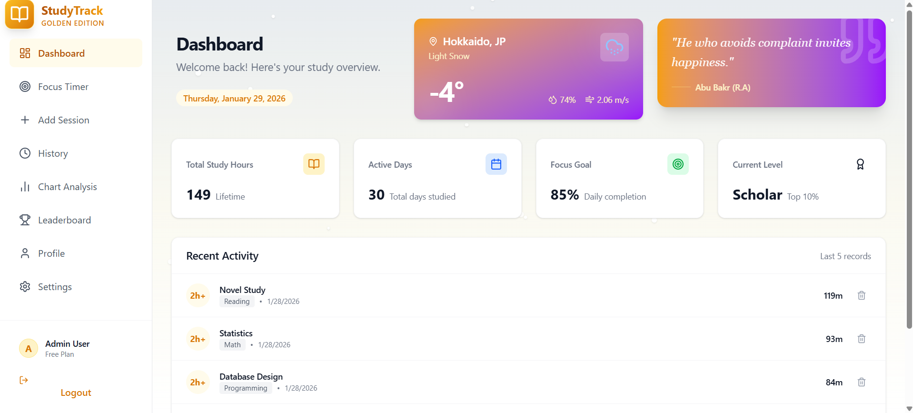

# StudyTrack Pro 🚀

StudyTrack Pro is a modern, full-stack web application designed to help students and professionals track their study hours, analyze their productivity, and stay motivated through gamification.


*(See `screenshots/screenshot_eng.png` for the preview!)*

> [**🇺🇸 English Version**](README.md) | [**🇯🇵 日本語版 (Japanese Version)**](README_ja.md)

---

## ✨ Features

### 📊 Dashboard & Analytics
- **Visual Analytics**: Interactive bar and pie charts to visualize study trends.
- **Enhanced Chart UI**: Responsive charts with a split-view Subject Distribution list for better readability.
- **Stats Overview**: Quick summary of total hours, tasks completed, and current streak.
- **Activity History**: Detailed log of all study sessions with filtering options.

### 🌦️ Immersive Weather Experience
- **Dynamic Backgrounds**: The application atmosphere adapts to real-time weather conditions (Sunny ☀️, Rainy 🌧️, Snowy ❄️).
- **Live Widget**: Dashboard displays current weather, temperature, and location.

### ⏱️ Focus Tools
- **Built-in Timer**: A dedicated focus timer to track live study sessions.
- **Real-time Logging**: Automatically creates a record when the timer stops.

### 🏆 Gamification
- **Leaderboard**: Compete with other users based on study time (XP).
- **Ranking System**: Earn ranks and badges as you study more.
- **Dynamic Scoring**: 1 minute of study = 10 XP.

### 👤 User Profile
- **Personalized Profile**: View your level, join date, and stats.
- **Custom Avatar**: Upload your own profile picture (supports crop & resize).
- **Edit Details**: Easily update your name, email, and password.

### 🌐 Internationalization (i18n)
- **Multi-language Support**: Fully localized in **English** and **Japanese**.
- **Integrated Toggle**: Seamlessly switch languages from the Login/Register screens.
- **Persistent Choice**: Remembers your language preference automatically.

### ✨ "Golden Light" Theme & UI
- **Premium Aesthetic**: A warm, prestigious **Golden/Amber** theme with a soft cream background.
- **Animated Experience**: Login & Register pages feature a **dynamic, moving gradient** with floating geometric particles.
- **Modern Interactions**: Buttons feature a stylish **Blue-Purple** gradient for high contrast and modern feel.

### 💬 Motivational Quotes
- **Daily Inspiration**: Displays a new motivational quote on the Dashboard.
- **Hybrid System**: Fetches from a live API (English) or uses a curated offline library (Japanese).

---

## 🛠️ Technology Stack

- **Frontend**: React.js (Vite), Tailwind CSS v4, Framer Motion (Animations), Recharts (Charts), Lucide React (Icons).
- **Internationalization**: i18next, react-i18next, i18next-browser-languagedetector.
- **Backend**: Node.js, Express.js.
- **Database**: MySQL.
- **Authentication**: JWT (JSON Web Tokens), BCrypt (Password Hashing).
- **File Handling**: Multer (Image Uploads).

---

## 🚀 Getting Started

Follow these steps to run the project locally.

### Prerequisites
- Node.js installed.
- MySQL installed and running (e.g., via XAMPP).

### 1. Database Setup
1. Open your MySQL client (e.g., phpMyAdmin).
2. Create a new database named `studytrack_db`.
3. Import the `database/schema.sql` file to create the tables.

### 2. Backend Setup
```bash
cd backend
npm install
# Create a .env file with your DB credentials & JWT_SECRET
node server.js
```

### 3. Frontend Setup
```bash
cd frontend
npm install
npm run dev
```

The app should now be running at `http://localhost:5173`.

---

## 📂 Project Structure

```
studytrack-pro/
├── backend/            # Express API & Database Logic
│   ├── controllers/    # API Controllers
│   ├── routes/         # API Routes
│   └── uploads/        # User uploaded images
├── frontend/           # React Application
│   ├── src/
│   │   ├── components/ # Reusable UI Components
│   │   ├── pages/      # Main Application Pages
│   │   └── api/        # API Integration
│   └── index.css       # Tailwind Imports
├── database/           # SQL Schema
├── design/             # Architecture & Planning Docs
└── screenshots/        # Project Images
```

---

## 🔒 Security
- Passwords are hashed using **bcrypt**.
- API endpoints are protected using **JWT**.
- File uploads are validated and renamed for security.

---

## 🤝 Contributing
Feel free to fork this repository and submit pull requests. Any improvements are welcome!

---

**Happy Studying! 📚**