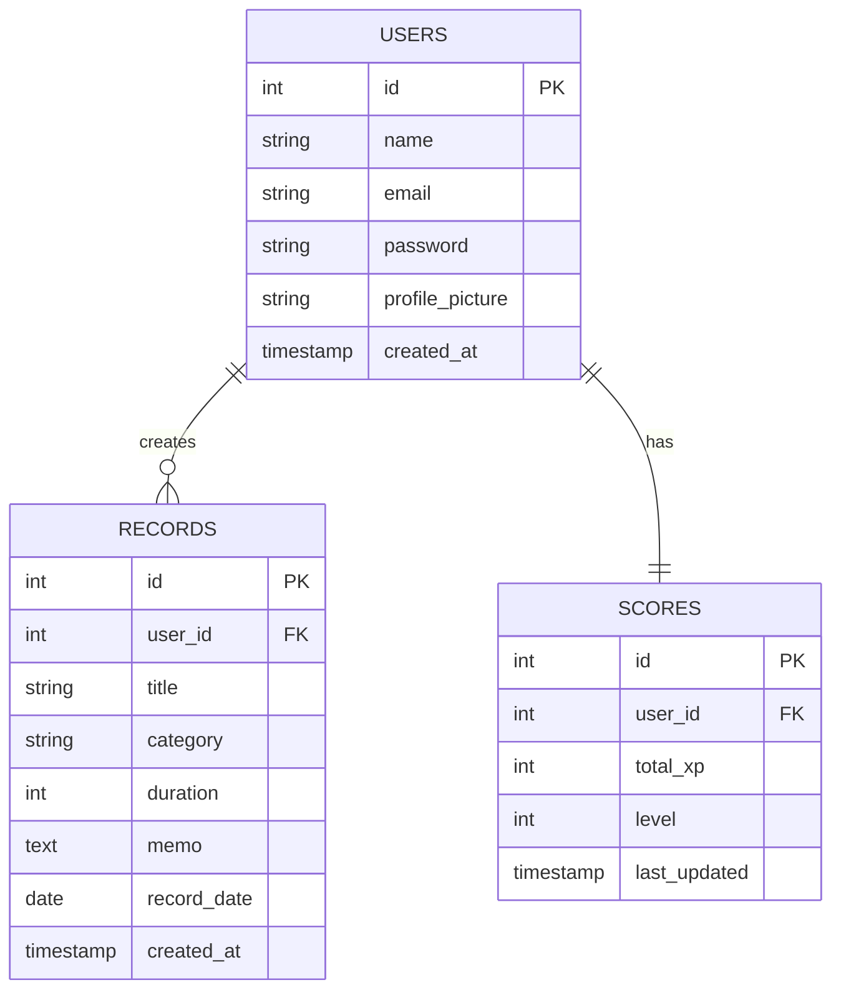

# ER Diagram – StudyTrack Pro

```mermaid
erDiagram
    USERS ||--o{ RECORDS : creates
    USERS ||--|| SCORES : has
    
    USERS {
        int id PK
        string name
        string email
        string password
        string profile_picture
        timestamp created_at
    }

    RECORDS {
        int id PK
        int user_id FK
        string title
        string category
        int duration
        text memo
        date record_date
        timestamp created_at
    }

    SCORES {
        int id PK
        int user_id FK
        int total_xp
        int level
        timestamp last_updated
    }
```