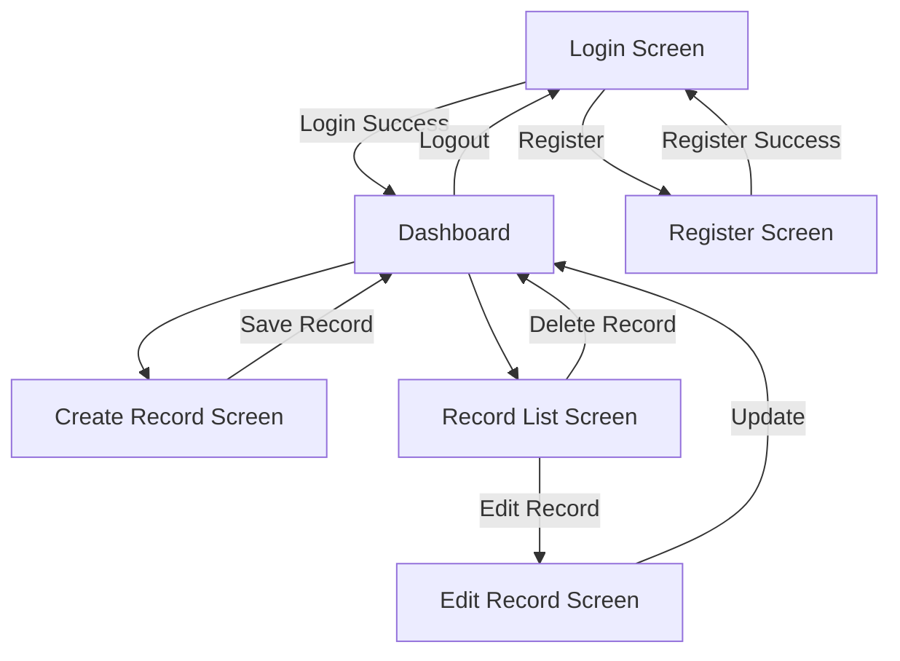

# Screen Transition Diagram – StudyTrack Pro

```mermaid
flowchart TD
    A[Login Screen] -->|Login Success| B[Dashboard]
    A -->|Register| C[Register Screen]
    C -->|Register Success| A

    B --> D[Create Record Screen]
    B --> E[Record List Screen]

    D -->|Save Record| B
    E -->|Edit Record| F[Edit Record Screen]
    F -->|Update| B

    E -->|Delete Record| B
    B -->|Logout| A
```